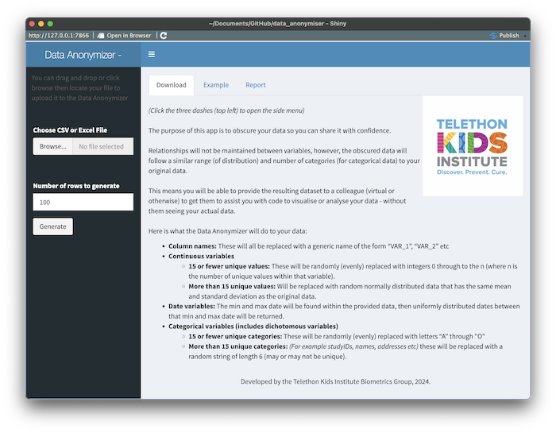

# Data Anonymiser - Shiny App

Contained in this repo is a shiny app and a test dataset (.xlsx). The shiny app will:

- take an uploaded dataset (.csv or .xlsx), 
- let you choose which variables to keep and how many rows you want returned,
- return a fully obscured dataset (.csv) for download.

A report is also provided, comparing the original data to the obscured data.

## Purpose

The purpose of this app to give the user quick and easy access to a dataset that is "similar" to their original data, but *completely obscured* to the point where they can be comfortable sharing the resulting file (dataset).

### Use case

A use case (that inspired the apps design) is where one wants to upload their dataset into a website to have AI help them write code to produce a figure (or series of figures) followed by some code to perform statistical analysis (for example, some complex modelling). Uploading their original data would likely be a breach of ethics and/or governance approvals. 

Yes, this could be done completely with synthetic data, but people often prefer to work with data that have a similar numeric range (or number of categories) to that of their actual data.

## Data obscuring

As explained on the app's landing page, the data obscuring process is as follows:

- **Column names:** These will all be replaced with a generic name of the form “VAR_1”, “VAR_2” etc
- **Continuous variables**
  - **15 or fewer unique values:** These will be randomly (evenly) replaced with integers 0 through to the n (where n is the number of unique values within that variable).
  - **More than 15 unique values:** Will be replaced with random normally distributed data that has the same mean and standard deviation as the original data.
- **Date variables:** The min and max date will be found within the provided data, then uniformly distributed dates between that min and max date will be returned.
- **Categorical variables (includes dichotomous variables)**
  - **15 or fewer unique categories:** These will be randomly (evenly) replaced with letters “A” through "O"
  - **More than 15 unique categories:** (For example studyIDs, names, addresses etc) these will be replaced with a random string of length 6 (may or may not be unique).

## Closing notes

### Notes

This app and the synthetic test dataset that accompanies it where both generated by ChatGPT. The app received minor aesthetic and text tweaks following 17 iteractions of prompting.

### Future enchancements

Future iterations may include:

- an option to maintain correlation between variables
- an option to include a percentage of missing data in the output